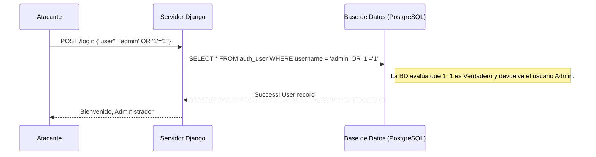
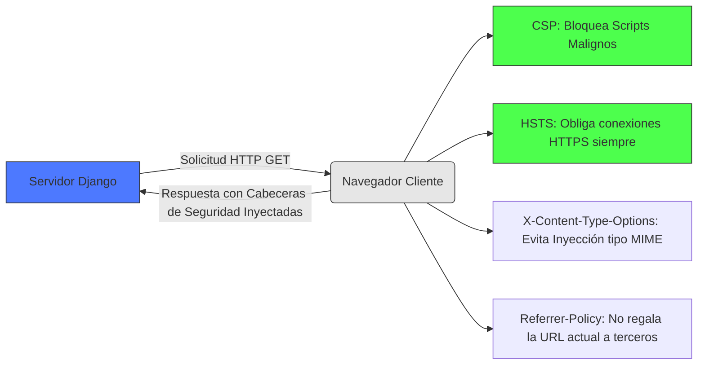
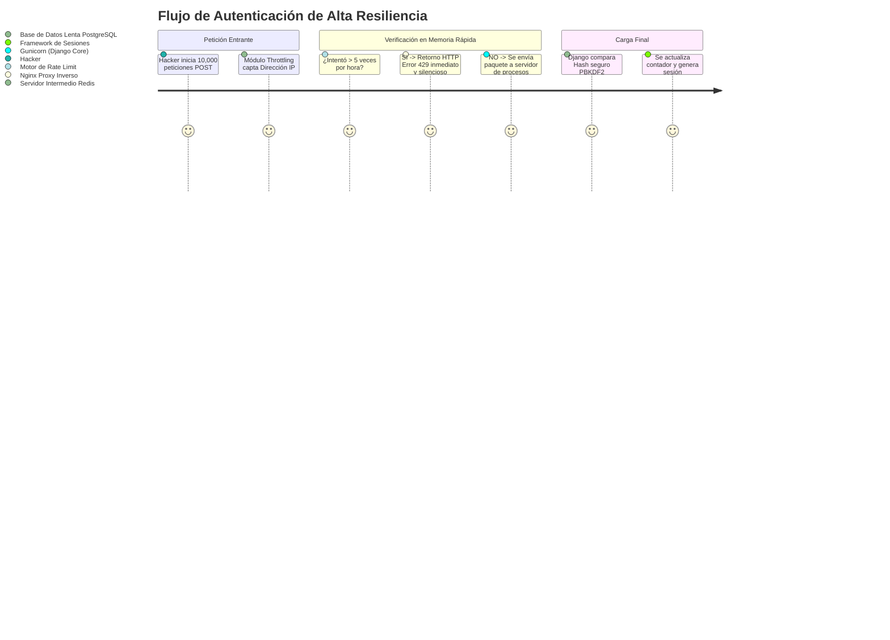
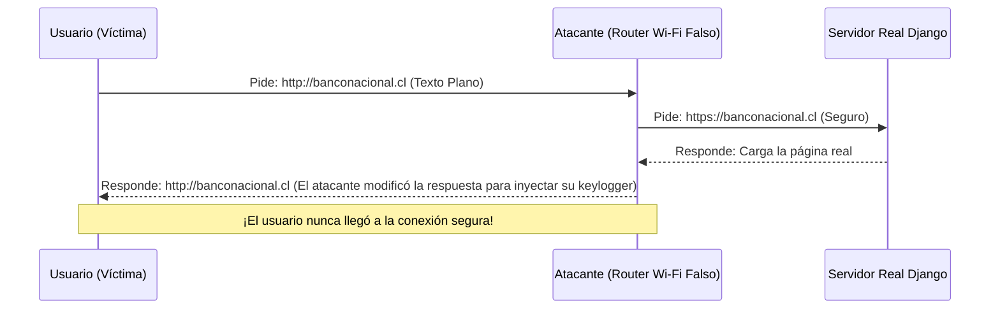

# Clase 14: Ciberseguridad Web Aplicada (Defensa en Profundidad y DevSecOps)

> [!IMPORTANT]
> **Nota para el Docente:** Este documento ha sido diseñado para ser proyectado y leído en conjunto. Se incluyen métricas reales al año 2026, diagramas de arquitectura de ataques, tablas comparativas y casos de estudio. Debido a la extensión y profundidad del contenido, se recomienda hacer pausas entre los módulos para asimilar los vectores de ataque.

¡Bienvenidos a un nuevo encuentro del módulo avanzado de Django! Hasta ahora, hemos aprendido a construir sistemas robustos e interconectados mediante nuestro framework en un entorno de desarrollo (localhost) limpio y controlado. Sin embargo, cuando conectamos nuestras aplicaciones al Internet público y damos el "paso a Producción", nuestro sistema deja de estar en un ambiente seguro para enfrentarse al mundo real: un ciberespacio hostil, automatizado y despiadado.

En esta sesión, abandonaremos temporalmente el rol de meros "creadores" y adoptaremos dos roles fundamentales en la ingeniería moderna: **La mentalidad del atacante (Red Team)** y **la mentalidad del arquitecto defensor (Blue Team / DevSecOps)**.

---

## Módulo 1: El Panorama Actual de las Amenazas Web (Perspectiva 2026)

La ciberseguridad ha dejado de ser "un lujo técnico de las grandes corporaciones". Hoy en día, es una obligación tanto técnica como legal (por regulaciones de protección de datos personales). 

### 1.1. El Fin de las Redes Confiables: "Zero Trust"

Durante la última década, el concepto de seguridad perimetral (imaginar nuestra red como un castillo con un muro impenetrable) ha quedado obsoleto. El modelo mental del año 2026 se conoce como **Zero Trust Architecture (Arquitectura de Confianza Cero)**.

> [!CAUTION]
> **La premisa de Zero Trust:** "No confíes en nada ni en nadie, ni siquiera en el usuario autenticado que está dentro de tu red corporativa. Asume siempre que tu sistema ya está parcialmente comprometido."

#### Comparativa de Modelos de Confianza

| Característica | Modelo Tradicional (Perimetral) | Modelo Zero Trust (Actual) |
| :--- | :--- | :--- |
| **Confianza base** | Se confía en quien está "dentro" de la red (LAN/VPN). | Nunca se confía. Se verifica cada petición individualmente. |
| **Autenticación** | Login único y sesión prolongada. | Autenticación continua, MFA obligatorio, validación de dispositivo. |
| **Acceso a datos** | Acceso amplio tras pasar el firewall. | Principio de Menor Privilegio (Just-In-Time access). |
| **Control de daños** | Si un atacante entra, tiene movimiento lateral libre. | Microsegmentación. Si cae un servidor, el atacante no puede ir a otro. |

---

### 1.2. Anatomía de un Ataque (Cyber Kill Chain)

Para defender un sistema, primero debemos entender los pasos metodológicos que toma un atacante profesional. No es "magia", es un proceso estructurado.

```mermaid
graph TD
    A[1. Reconocimiento (Recon)] --> B[2. Preparación de Armas (Weaponization)]
    B --> C[3. Entrega (Delivery)]
    C --> D[4. Explotación (Exploitation)]
    D --> E[5. Instalación de Backdoors]
    E --> F[6. Comando y Control]
    F --> G[7. Exfiltración de Datos / Extorsión]

    style A fill:#ff9999,stroke:#333,stroke-width:2px
    style D fill:#ff4d4d,stroke:#333,stroke-width:2px
    style G fill:#cc0000,stroke:#333,stroke-width:4px,color:white
```

*   **1. Reconocimiento:** El atacante usa scripts para ver qué versión de Django y qué librerías tiene nuestra empresa chilena de retail ("Comercializadora Sur").
*   **4. Explotación:** Encuentra un formulario que no tiene validación y manda un *Cross-Site Scripting*.
*   **7. Exfiltración:** Los datos de 50,000 clientes chilenos son robados y vendidos, o encriptados pidiendo rescate (Ransomware).

---

### 1.3. Métricas y Costos de un "Data Breach" (Brecha de Datos)

¿Qué pasa si fallamos como programadores y el sistema es hackeado? El impacto no es solo un mal rato, es la quiebra potencial de la empresa que nos contrató. Basado en informes recientes y proyecciones (como el de IBM Security Cost of a Data Breach y reportes de la Policía de Investigaciones de Chile PDI):

*   **Costo promedio global:** Se estima que en 2026 el costo promedio de una brecha cibernética alcanza los **$5.2 Millones de Dólares**, sumando multas regulatorias, pérdida de clientes, juicios y restauración tecnológica.
*   **Vectores de entrada líderes:**
    1.  **Credenciales Robadas (Phishing / Fuerza Bruta):** 36% de los ataques inician aquí.
    2.  **Vulnerabilidades en software de terceros (Supply Chain):** 24% de los ataques.
    3.  **Configuraciones en la nube inseguras:** 15%.

---

## Módulo 2: Vulnerabilidades "OWASP Top 10" y la Respuesta Nivel 1 de Django

El **OWASP (Open Worldwide Application Security Project)** es el estándar de oro en ciberseguridad. Mantienen una lista actualizada de las 10 vulnerabilidades web más críticas. Analizaremos las principales y cómo el "Escudo de Fábrica" de Django las contrarresta (o no).

### 2.1. Inyección (SQL Injection - SQLi)

El ataque más antiguo y letal. Un atacante inserta código SQL manipulado dentro de un campo de texto (como el buscador de productos) para forzar a la base de datos a ejecutar un comando no planeado.

> [!WARNING]
> **Daño Potencial:** El atacante puede borrar tu base de datos (Ejemplo: `DROP TABLE Users;`) o exportar todas las contraseñas sin ser administrador.

#### ¿Cómo ocurre visualmente un SQLi?



#### Prevención Nativa en Django
Felizmente, **Django nos protege por defecto en un 99%** de estos ataques gracias al ORM (Object-Relational Mapping). El ORM de Django usa un mecanismo llamado *Consultas Parametrizadas*, que sanitiza automáticamente las comillas y caracteres maliciosos.

Código Seguro (ORM de Django):
```python
# Django limpia el string y evita la inyección automáticamente
user = User.objects.filter(username=request.POST['username']).first()
```

🚨 **El Peligro Real en Django:** El atacante ganará si usamos **Consultas Crudas (Raw Queries)** sin paramatrizar, como se hacía hace 15 años:
```python
# ¡CÓDIGO EXTREMADAMENTE PELIGROSO! (No hacer esto)
from django.db import connection
cursor = connection.cursor()
cursor.execute(f"SELECT * FROM users WHERE username = '{request.POST['username']}'")
```

---

### 2.2. Cross-Site Scripting (XSS)

Si el SQLi ataca al servidor, **el XSS ataca a otros usuarios**. Ocurre cuando un ciberdelincuente inyecta un fragmento de JavaScript en tu base de datos (por ejemplo, comentando en el foro de nuestra plataforma educativa). Luego, cuando la profesora entra a leer los comentarios, ese JavaScript malicioso se ejecuta en el navegador de la profesora (¡y el atacante le roba la cookie de sesión o le cambia la contraseña!).

#### Prevención Nativa en Django
Django tiene incorporado un **Mecanismo de Auto-Escape** en el motor de plantillas (`.html`). Si un atacante inyecta script, Django convierte los caracteres peligrosos `<` y `>` en sus equivalentes inofensivos de HTML (`&lt;` y `&gt;`).

```html
<!-- Si el atacante escribió: <script>alert("Hackeado")</script> -->

<!-- Django lo renderiza inofensivamente en el navegador como: -->
&lt;script&gt;alert("Hackeado")&lt;/script&gt;
```

🚨 **El Peligro Real en Django:** Nosotros mismos apagamos el escudo cuando usamos el filtro `|safe` en nuestras plantillas para mostrar HTML con formato. Si ponemos `{{ comentario.texto|safe }}`, y el usuario escribió un `<script>`, el navegador ¡lo ejecutará! Jamás uses `|safe` con datos que provienen de usuarios, siempre confía en librerías limpiadoras como *Bleach* si necesitas permitir formato HTML como negritas en tu plataforma.

---

### 2.3. Cross-Site Request Forgery (CSRF - Falsificación de Petición)

Esto ocurre cuando el atacante crea un sitio web falso (con gatitos) y, escondido en la página, hay un formulario invisible que envía una petición POST hacia tu sistema de Django (ej. a la ruta `/transferir-fondos`). Como el usuario en ese momento tiene su cuenta del banco abierta en otra pestaña, el navegador manda las cookies automáticamente y la transacción se realiza sin que el usuario lo note.

#### Prevención Nativa en Django
A diferencia de los lenguajes puros, Django trae activado de fábrica el `CsrfViewMiddleware` en nuestro `settings.py`. Este middleware interrumpe *cualquier* intento POST, PUT o DELETE que no traiga un secreto único y encriptado que sólo el verdadero servidor conoce.

> [!TIP]
> Por esto siempre debes incluir `` adentro de todos los `<form method="POST">` de tu sitio. Sin esa tarjeta de invitación única, Django devuelve un Error 403 Forbidden y detiene el ataque.

---

## Módulo 3: El Nuevo Terror: Ataques de Cadena de Suministro (Supply Chain)

En el año 2026, los atacantes se dieron cuenta de algo: Es muy difícil hackear el código directo de un programador senior de Django. Las defensas de Django son buenas. Pero un programador experto jamás escribe un sitio web desde cero. Usa dependencias. 

En nuestro entorno virtual, hacemos `pip install django-crispy-forms`, `pip install pillow`, etc. 
**¿Qué pasa si el atacante hackea al creador de `django-crispy-forms` y modifica la librería pública para que contenga un virus oculto?** Si hacemos "pip install", estaremos metiendo al atacante directo y legalmente a nuestro servidor. Esto es el Supply Chain Attack.

### Casos Reales Devastadores
1.  **Log4j (2021):** Una vulnerabilidad en una pequeña librería para hacer `logs` en Java destruyó la red de gigantes como Amazon, Microsoft y Apple. Se estima que costó billones en reparaciones mundiales y extorsiones.
2.  **La Infiltración de XZ Utils (2024):** Este es un caso de espionaje del más alto nivel. Un programa de compresión de Linux usado globalmente fue comprometido. Pero no fue un hackeo, ¡fue ingeniería social corporativa! Un espía (posiblemente estatal) trabajó "gratis" y generó confianza arreglando el código de esa librería pública por 2 AÑOS enteros. Una vez que le dieron permisos de administrador de la librería comunitaria, introdujo un código ilegible que abría una puerta trasera (Backdoor) en el sistema.

### 3.1. ¿Cómo Analizar si una Librería de Terceros es Segura?

Antes de instalar *CUALQUIER* cosa en el proyecto de tu trabajo con `pip install ...`, el Arquitecto de Seguridad (ustedes) debe pasar por el siguiente **Diagrama de Decisión Riguroso**:

| Criterio a Evaluar | ¿Qué buscar? (Buen indicador) | ¿Qué rechazar? (Riesgo Crítico) |
| :--- | :--- | :--- |
| **1. Antigüedad del Último Commit** | Repositorio activo, último commit reciente (últimos meses). | El repositorio no se actualiza hace 2 o 3 años. ¡Es un proyecto abandonado (Zombie)! |
| **2. Mantenedores Activos** | Hay un equipo de 3 o más mantenedores que responden las dudas. | Un solo desarrollador en su tiempo libre (El "Síndrome del Bus"). |
| **3. Issue Tracker (Transparencia)** | Los problemas se abren y la comunidad los cierra colaborativamente. | Hay 800 issues abiertos sin respuesta desde hace años y docenas de quejas. |
| **4. Soporte Financiero/Organizacional** | Patrocinado por corporaciones grandes (como *Django Software Foundation*, *Mozilla*). | Un proyecto sin fin de lucro oculto sin información del autor real. |
| **5. Política Resolutiva (`SECURITY.md`)** | El repositorio en GitHub tiene una pestaña de "Seguridad" que indica claramente cómo reportar fallos de forma privada. | Si encuentras un fallo, el único lado para decirlo es el chat público, avisando a los hackers. |

---

### 3.2. Automatizando el Control con DevSecOps

Revisar librerías manualmente funcionaba en 2010. Hoy, donde un proyecto real tiene más de 80 sub-dependencias, la revisión debe ser automatizada (lo que llamamos DevSecOps, incluir la seguridad dentro de las operaciones).

#### La herramienta: `pip-audit`
En lugar de suponer, le preguntamos a la base de datos mundial de vulnerabilidades conocidas (CVE) si lo que instalamos es peligroso.

```bash
# Instalamos la herramienta de auditoría global
pip install pip-audit

# Comparamos nuestras librerías con la base de datos de atacantes mundiales
pip-audit
```

**Salida Simulada de un Peligro (Ejemplo Práctico en Consola):**
```text
Found 2 known vulnerabilities in 1 package
Name   Version ID             Fix Versions
----   ------- -------------- ------------
Pillow 9.0.0   CVE-2022-22815 9.0.1
Pillow 9.0.0   CVE-2022-22816 9.0.1
```
> [!IMPORTANT]
> **Plan de Acción:** El sistema nos ha gritado que `Pillow` (procesador de imágenes en Python) versión 9.0.0 permite una Inyección en Memoria y requiere urgente la versión `9.0.1`. El DevSecOps debe parar la salida a producción, actualizar el `requirements.txt` y correr los tests de nuevo.

---

*(Fin de la Parte 1. Por favor, solicite continuar para generar la Parte 2: Arquitectura Defensiva Avanzada, Control de Rate Limits, Políticas Content-Security-Policy Strict, Variables de Entorno, HSTS y Check-lists finales).*

## Módulo 4: Datos Nivel "Insider" y Métricas de Ciberseguridad 2026

Para que se conviertan en verdaderos líderes DevSecOps, deben conocer el panorama que los gerentes de infraestructura enfrentan en 2026. Los desarrolladores Junior solo piensan en "que el código funcione", el Senior piensa en "cómo se escala", pero el Arquitecto de Seguridad piensa en "cuándo, no si, seremos hackeados".

### 4.1. Métricas Sorprendentes (Estado de la Red 2026)

> [!TIP]
> **Insider Tip (Información Privilegiada):** Cuando presenten un proyecto de mejora de seguridad a la gerencia para pedir presupuesto, nunca hablen de "Cross-Site Scripting" o "Módulos de Python". Esos términos aburren a los gerentes. Hablen en el único idioma que entienden: **Riesgo Operacional y Dinero Público.** 

Utilicen estas cifras para justificar sus decisiones arquitectónicas:

*   **El impacto de la "Generative AI" en el Phishing:** En 2026, los correos de phishing ya no tienen faltas de ortografía. Los ataques de *Spear Phishing* automatizados por IA contra empleados clave (como desarrolladores que tienen acceso a GitHub y AWS) aumentaron un **850%**. La única defensa es la autenticación FIDO2 / Passkeys. Las contraseñas tradicionales ya están virtualmente muertas.
*   **Tiempo medio para identificar y contener una brecha (MTTI / MTTC):** El promedio global es de **277 días**. Es decir, un atacante está viviendo dentro del servidor de la empresa chilena promedio durante más de 8 meses antes de que alguien se dé cuenta.
*   **Ataques Distribuidos (DDoS) Impulsados por IoT:** El tamaño promedio de un ataque de denegación de servicio (DDoS) ha superado sistemáticamente los **3.5 Terabits por segundo (Tbps)**. Ni el servidor más poderoso de AWS puede soportar eso sin un firewall inteligente de capa 7 (WAF) intermediando.
*   **Exfiltración Silenciosa por APIs (API Abuse):** El 65% de los robos de datos actuales no ocurren hackeando la base de datos central, ocurre abusando de las APIs REST (construidas con Django REST Framework, por ejemplo) mal mal configuradas (End-points que devuelven más datos de los necesarios o sin paginación segura).

### 4.2. El Factor Humano y la Ingeniería Social (Cifras Reales en Chile)

El CISO (Chief Information Security Officer) de una empresa transnacional nos dirá siempre este secreto: *"Puedo gastar un millón de dólares en firewalls, pero un solo desarrollador frustrado o descuidado puede destruirnos gratis"*.

| Tipo de Error Humano | Frecuencia de Aparición | Impacto Económico Promedio | Prevención en DevSecOps |
| :--- | :--- | :--- | :--- |
| **Credenciales en GitHub** | Extremadamente Alta (Diario) | Crítico (Quiebra inmediata) | Escáner pre-commit (`git-secrets`, TruffleHog) |
| **Buckets AWS/S3 Públicos** | Muy Alta (Semanal) | Crítico (Datos filtrados) | Auditoría IAC (Infraestructura como Código) constante |
| **Reutilización de Contraseña** | Alta (80% de empleados) | Alto (Robo de identidad) | Políticas de Contraseña Nivel NIST, MFA estricto |
| **Ingeniería Social (Telefónica/Deepfake)** | Media (Aumento Exponencial) | Crítico (Robo de Tokens/VPN) | Cultura de Verificación Zero Trust y Passkeys Biométricos |


---

## Módulo 5: Defensa Front-End Avanzada (El Arte de las Cabeceras)

Un desarrollador prolijo entiende que Django se ejecuta en un servidor Linux. Pero la mitad de la seguridad ocurre en el **Navegador del Cliente** (Google Chrome, Firefox). Podemos instruir al navegador del cliente chileno para que actúe como nuestro guardaespaldas usando Cabeceras HTTP (HTTP Headers) extremas.

### 5.1. El Ecosistema de las Cabeceras de Seguridad



> [!IMPORTANT]
> **Insider Tip (Información Privilegiada):** Las cabeceras HTTP son la línea defensiva más barata de implementar y la más efectiva en la vida real. Si tu profesor proyecta una pantalla y audita el banco local o el retail nacional, frecuentemente encontrará que tienen una calificación "C" o "D" en auditorías públicas de cabeceras web (como _securityheaders.com_). Si configuran bien un proyecto, obtendrán un puntaje "A+" y parecerán ingenieros senior de la NASA frente a sus empleadores.

### 5.2. CORS (Cross-Origin Resource Sharing): El Mayor Error de las APIs

El CORS ha sido el causante del 90% de los dolores de cabeza de todo desarrollador Frontend que intenta conectar su React/Angular con una API de Django. Pero es vital entender que **el error CORS no es un error del servidor, es un bloqueo de protección del navegador**.

El navegador detecta que una página alojada en `http://frontend.cl` está intentando hacer una petición (ej. un POST) a `http://api-backend-django.cl`. Como los orígenes (dominios) son distintos, el navegador bloquea la acción para evitar que una página maliciosa robe tu sesión bancaria por detrás.

> [!CAUTION]
> **El Pecado Capital del CORS:** Muchos desarrolladores, al ver el texto rojo gigante en su consola de Google Chrome que dice "CORS BLOCK", van a internet, buscan en StackOverflow, copian y pegan, e instalan `django-cors-headers` poniendo `CORS_ALLOW_ALL_ORIGINS = True` en `settings.py`. ¡Esto acaba de eliminar la protección más básica y permite que literalmente cualquier sitio web del mundo haga llamadas falsificadas a nuestra API!

**Solución DevSecOps (CORS Estricto en Producción):**
Nunca se permite todo. La regla es blanquear dominios estrictos que pertenecen a la misma estructura jerárquica corporativa.

```python
# settings.py 
# Lista blanca exclusiva. El navegador solo dejará pasar peticiones de la sucursal de Antofagasta y el Frontend Oficial.

CORS_ALLOWED_ORIGINS = [
    "https://frontend-oficial.com",
    "https://sucursal-antofagasta.portal",
]
```

### 5.3. Política de Seguridad de Contenido Extrema (CSP)

El CSP es la defensa militar suprema contra inyecciones XSS, scripts maliciosos, criptomineros (minería de Bitcoin escondida en JS) y Keyloggers web.

Si implementamos la librería `django-csp`, añadiremos configuraciones estrictas instruyendo al navegador que bloquee todo script que parezca sospechoso o externo, incluso si pasó nuestras validaciones en la base de datos.
La configuración manual de las variables `CSP_DEFAULT_SRC`, `CSP_SCRIPT_SRC`, `CSP_IMG_SRC`, y `CSP_STYLE_SRC` conforman lo que llamamos el escudo "Default Deny" (Denegar por defecto).

#### Desglose de un CSP Ultra-Estricto
*   `default-src 'none'`: Todo recurso bloqueado de base (Cero Absoluto).
*   `script-src 'self' https://cdnjs.cloudflare.com`: Los JS solo corren si provienen de nuestro propio dominio (`'self'`) o del servidor seguro de CDN (Cloudflare).
*   `img-src 'self' data:`: Imágenes permitidas si vienen de nuestro server o como Data URI puro.
*   `style-src 'self' 'unsafe-inline'`: (Peligro pero útil) Para TailwindCSS o Bootstrap en frameworks modernos, permite estilos embebidos, pero sólo si estamos seguros de que no comprometen la capa DOM.

> [!NOTE]
> **Insider Tip (Información Privilegiada):** La técnica ninja en industrias bancarias es usar **Nonces (Número Usado Una Vez)**. Django genera un código aleatorio inquebrantable en cada recarga de página (ej: `nonce="3x4mPl3"`). El JS solo se ejecutará si la etiqueta del script dice `<script nonce="{{request.csp_nonce}}">`. Los atacantes no pueden adivinar este código y sus inyecciones XSS quedan obsoletas para siempre.

---

## Módulo 6: Hardening Absoluto en el Servidor (Rate Limiting y Control de Fuerza Bruta)

Volvamos a la amenaza de Credential Stuffing (cuando mil bots intentan robar la cuenta del gerente inyectando contraseñas). En un tutorial básico, se enseña a validar al usuario con `authenticate(request, username, password)`. En un entorno real, si esa validación es probada 10,000 veces en 3 minutos, el servidor de la empresa entra en Denegación de Servicio (DoS), la memoria RAM explota, el cliente no puede facturar y hay millonarias pérdidas de capital.

### 6.1. La solución: Rate Limiting y Throttling Algorítmico

Es imperativo implementar limitadores de tasa (Rate Limiting). En proyectos Django puros, esto se controla mediante decoradores inteligentes en las Vistas (Views) problemáticas (usando librerías especializadas como `django-ratelimit`).

#### Estrategia Defensiva Real

1.  **Detección:** Captamos la dirección IP remota (`REMOTE_ADDR`) desde el bloque `request.META`. El atacante manda "juan" y clave "1234". Falla.
2.  **Registro Rápido:** Guardamos el intento fallido en una memoria extremadamente rápida, *jamás en la base de datos principal PostgreSQL* (porque colapsaría el disco duro con millones de lecturas rápidas). Usamos "Redis" o "Memcached", sistemas en memoria RAM diseñados para soportar millones de escrituras por segundo, donde cada fallo agrega un número a un contador.
3.  **Bloqueo y Penalización Temporal:**
    *   Fallo 1-4: Advertencia silenciosa.
    *   Fallo 5: Se bloquea la IP por 1 hora (Throw 429 Too Many Requests).
    *   Fallo (Detección Geográfica): Si la IP proviene de un país sancionado cibernéticamente, lanzar un Captha v3 invisible estricto.



---

## Módulo 7: Gestión de Secretos y Variables de Entorno (.env)

El pecado más vergonzoso de un proyecto web: Subir la base de código entera a un repositorio público en GitHub (o incluso uno corporativo privado pero accedido por 500 empleados), manteniendo los secretos de producción en texto claro (hardcoded). 

Dentro del archivo `settings.py` de todo proyecto nuevo, Django inyecta una variable enorme en la parte superior:
```python
# SECURITY WARNING: keep the secret key used in production secret!
SECRET_KEY = 'django-insecure-xxXxx_secreto_absoluto_xxXxx'
```

> [!CAUTION]
> **Consecuencia Legal Real:** La `SECRET_KEY` en Django es fundamental. Con ella, Django firma (encripta) las sesiones de los usuarios, firma el generador de tokens CSRF e incluso permite generar contraseñas seguras para la recuperación de cuentas. Si un atacante roba esa llave, puede fabricar una Cookie de Administrador ("Superuser=True") y secuestrar cuentas de manera indetectable desde el exterior. El daño excede la base de datos: expone la infraestructura entera.

### 7.1. Patrón DevOps de 12 Factores

El patrón global en el año 2026 dicta: **"La configuración, y en especial los secretos de seguridad financiera e infraestructura, se deben separar estrictamente y totalmente del código fuente."**

### La Herramienta Imprescindible: Python-Dotenv

La estrategia que exige la industria es manejar variables dependientes del entorno en que corre la aplicación. En lugar de escribir explícitamente el secreto en la línea 24 del archivo `settings.py`, debemos leerlo de nuestro sistema operativo, usando la librería estándar `os`.

Para facilitar y organizar la lectura de estas variables invisibles en nuestro computador de desarrollo, usamos `python-dotenv`.

**El flujo del devOps moderno (pasos de protección de base a código)**

1.  Se crea un nuevo proyecto, el primer archivo después de `manage.py` deberá ser `.env`. Se aloja de forma paralela en la raíz superior del proyecto (donde está también el `.gitignore`).
2.  De forma inmediata y sin vacilaciones, se anota `.env` adentro del archivo `.gitignore`. Si alguna de nuestras herramientas por consola intenta subir el código a la nube (AWS CodeCommit o GitHub), saltará ignorando este archivo sagrado.
3.  El equipo de seguridad corporativo abre el `.env` (directamente en la consola Ubuntu/Linux de la nube privada, conectándose por claves SSH), y anotan las claves productivas que nunca llegan veamos los programadores de bajo nivel:

*Estructura del formato INI del `.env`:*
```env
# ==== VARIABLES CRITICAS DE SERVIDOR (NO COMPARTIR) ====
DJANGO_SECRET_KEY='secreto_super_complejo_hasheado_128_bits'
DJANGO_DEBUG_STATE=False

# ==== CREDENCIALES FINANCIERAS ====
STRIPE_API_KEY='TU_CLAVE_STRIPE_AQUI'  # Formato real: sk_live_... (solo en entorno seguro)

# ==== CREDENCIALES DE BASE DE DATOS MASTER ====
DB_HOST='10.12.3.4'
DB_USER='super_admin'
DB_PASS='C0ntra5eñ@S3gur4!'
```

4.  Entonces los desarrolladores, en el archivo universal y subido al repositorio (`settings.py`), leen todo del entorno, usando cast y fallbacks (valores por defecto seguros) para evitar que falle el servidor:

```python
import os
from dotenv import load_dotenv

# Carga masiva de todo el archivo secreto al entorno físico temporal
load_dotenv() 

# 1. Obtenemos el secreto crítico, o estallamos el servidor si falta.
SECRET_KEY = os.environ.get('DJANGO_SECRET_KEY', default='ALERTA_FALTA_CLAVE')

# 2. Obligamos un tipo de validación booleana estricta del entorno
DEBUG = os.environ.get('DJANGO_DEBUG_STATE') == 'True'

# 3. Y validamos y conectamos la BD. Todo es hermético y ciego.
DATABASES = {
    'default': {
        'ENGINE': 'django.db.backends.postgresql',
        'NAME': 'banco_nacional',
        'USER': os.environ.get('DB_USER'),
        'PASSWORD': os.environ.get('DB_PASS'),
        'HOST': os.environ.get('DB_HOST'),
        'PORT': '5432',
    }
}
```

> [!TIP]
> **Insider Tip (Información Privilegiada):** El error número 1 al evaluar a Juniors en entrevistas técnicas DevOps, es que utilizan `os.environ['SECRETO']`. Esto es propenso a errores. Si el dev olvidó colocar un salto de línea en el `.env` del servidor de producción, el KeyError que genera Python **expondrá instantáneamente casi todos los otros secretos colindantes del entorno** en la traza final del Stacktrace del sistema Linux. Usen siempre `os.environ.get()` o un módulo de parseo de entornos avanzado (e.g. `environ`, `decouple`), que en el año 2026 previene fugas laterales.

## Módulo 8: Aseguramiento de Comunicaciones (HSTS y Sesiones)

Acabamos de asegurar la inyección SQL, el XSS, la protección por fuerza bruta y ocultado las llaves maestras en un entorno no versionado (`.env`). ¿Pero qué pasa si el atacante ni siquiera necesita entrar a nuestro servidor? ¿Qué pasa si el atacante hackea el enrutador Wi-Fi de un Starbucks en Providencia (Santiago) y simplemente se sienta a "escuchar" lo que hacen el resto de los clientes en sus portátiles?

Esta técnica clásica, de la Edad de Piedra de internet, pero aún destructiva, se llama **Ataque Man-in-the-Middle (Hombre en el Medio - MITM)** o "Sniffing".

### 8.1. La Falsa Seguridad del Candado Verde (HTTPS)

Creemos que si entramos a `https://banconacional.cl` estamos seguros. Pero el usuario promedio en 2026 sigue escribiendo en su navegador `banconacional.cl` a secas o entra mediante un enlace antiguo HTTP sin encriptar. Un router malicioso atrapará ese primer salto HTTP (texto plano) y lo desviará hacia una réplica perfecta del banco (Phishing), antes de que el servidor real pueda redireccionarlo a HTTPS. Esto se conoce como **SSL Stripping**.



### 8.2. HSTS (Strict-Transport-Security): La Contramedida DevSecOps

Para matar esta vulnerabilidad, los navegadores crearon el HSTS (Seguridad de Transporte Estricta HTTP). Si un servidor Django manda esta cabecera *una sola vez*, el navegador de la víctima dejará grabada a fuego una regla: "Para el dominio `banconacional.cl`, sin importar si el usuario escribe http://, tú vas a cambiarlo artificial y localmente a https:// ANTES de enviar el primer paquete de red al router".

> [!CAUTION]
> **Insider Tip (Información Privilegiada):** El peligro del HSTS es que si lo configuran mal, "quemarán" su propio dominio web para todos los clientes mundiales y los clientes no podrán entrar por meses. Nunca pongan `SECURE_HSTS_SECONDS = 31536000` (1 año) en la primera semana que sale el proyecto a internet. Pongan 3600 (1 hora), pruébenlo. Si funciona, súbanlo a un mes, y si todo el sitio es perfectamente HTTPS y sus SSL certificados no caducan, pónganlo en 1 año y métanlo a la "Lista de Precarga HSTS de Chrome". Si están en la "HSTS Preload List" oficial de Google (apunta los apuntes a `hstspreload.org`), literalmente sus sitios web nacen seguros y un ataque MITM SSL Stripping es matemáticamente imposible en todo el planeta.

**Configuración Django para Blindaje Total de Tráfico:**

```python
# settings.py de Producción

# 1. Fuerza HTTPS sobre todas las redirecciones.
SECURE_SSL_REDIRECT = True 

# 2. Instruye al navegador a quemar la ruta segura por 1 año.
SECURE_HSTS_SECONDS = 31536000 

# 3. Incluye todo subdominio (ej: api.midominio.cl también es forzado).
SECURE_HSTS_INCLUDE_SUBDOMAINS = True

# 4. Autoriza enlistar globalmente a nivel código fuente en Navegadores.
SECURE_HSTS_PRELOAD = True
```

### 8.3. El Secuestro de Sesión y las Cookies Intocables

En Django, después de que verifiqué que su clave era correcta, ¿cómo sabe el servidor que soy Yo si le pido ver mi carrito de compras 1 minuto después? El servidor Django manda una **Cookie** minúscula al cliente con un código incomprensible (Ej: `sessionid=a94a8fe5ccb...`).

> [!CAUTION]
> **El problema:** Si esa cookie viaja como texto plano, o peor, si se puede leer a través de código JavaScript, cualquier ataque de inyección web XSS, o cualquier red de Wi-Fi abierta puede robarla. Quien tenga ese código temporal `a94...` ES USTED PARA EL SERVIDOR. Ni contraseña, ni validación facial, sólo se necesita la cookie para apoderarse de la cuenta del Gerente.

Para sellar las cookies de sesión con candado militar en Django 2026, requerimos habilitar **flags (banderas)** sobre el empaque de la Cookie:

| Bandera (Flag) | Configuración Django | Efecto en la Realidad | ¿Por qué es Vital? |
| :--- | :--- | :--- | :--- |
| **Secure** | `SESSION_COOKIE_SECURE = True` | El navegador destruirá la cookie / se rehusará a enviarla si la conexión no es HTTPS. | Previene el robo en redes Wi-fi públicas (Sniffing pasivo). |
| **HttpOnly** | Viene activo por defecto en Session | Indica al disco duro que CERO CÓDIGO JavaScript en el mundo tiene permiso para leer su contenido. | Neutraliza mágicamente el robo de sesión por inyección XSS. Ningún script malicioso puede leer `document.cookie`. |
| **SameSite** | `SESSION_COOKIE_SAMESITE = 'Strict'` | Indica que si usted entra a la web mediante un enlace externo desde Google/Facebook, el navegador no enviará la cookie en ese primer salto (y mandará una petición anónima). | Es el último clavo en el ataúd de los ataques CSRF (Falsificación de Petición). |

Al combinar el `CsrfViewMiddleware` con un `SESSION_COOKIE_SAMESITE = 'Strict'`, hemos blindado el flujo total para un banco moderno en una configuración de Django 100% resiliente.

---

## Módulo 9: Auditoría Continua de Alta Resiliencia (SOC Analytics)

Para cuando nos graduemos de un simple equipo de programadores y adoptemos un modelo SRE (Site Reliability Engineering), nos daremos cuenta de un segundo problema organizacional crítico.

> [!NOTE]
> **Insider Tip (Información Privilegiada):** Cuando un sistema interno de una minera es hackeado, la policía de ciber-delincuencia o el equipo jurídico legal interno va a hacerte dos preguntas: "¿Qué usuario hizo qué cosa y A QUÉ HORA EXACTA modificó el registro de sueldo de este empleado?". Si tú en ese momento pones cara de pánico y dices: *"Es que la base de datos de Django solo sobreescribe el campo final y no guarda un log histórico de quién lo modificó"*. Estás en problemas, tu empresa acaba de perder el juicio legal de auditoría.

**¡La auditoría interna en 2026 no es opcional, está auditada por estándares compliances ISO 27001!** Toda acción destructiva o de lectura sensible debe contar con un **Log de Auditoría Inmutable**.

### 9.1. El Registro de Trazabilidad (Audit Trail)
Django por defecto tiene un sistema de control para las acciones que toma el Administrador desde el panel `/admin`, pero si borras algo desde la web pública (usando código, vistas, u otras APIs), Django borra el registro permanentemente (hace un `DELETE` en SQL directo).

Para evitar que nuestro barco arda por dentro con un "Insider Threat" (amenaza interna, por ejemplo, un empleado malversando recursos), el equipo DevSecOps instala y configura rastreadores pasivos.

**Solución Preferente: `django-auditlog`**

*   Se integra sobre los Modelos principales como un decorador mágico o clase herencia paralela.
*   Crea un registro espejo. Si en el `models.py` tienes la tabla `PacienteMedico`, y le añades el rastreador, pasará a ocurrir esto:

| Acción SQL Ejecutada | Lo que el equipo Dev ve | Lo que DevSecOps registra con AuditLog |
| :--- | :--- | :--- |
| Creación | Paciente "Juan Perez" Creado | `[2026-10-14 10:45:00] user:dr_silva -> Creado "Paciente:Juan" (ip: 10.0.0.3)` |
| Edición de Diagnóstico | Valor D = "Tuberculosis" | `[2026-10-15 08:32:11] user:dr_silva_MODIFICADO -> Campo D: from "Tos" to "Tuberculosis"` |
| Borrado Ilegal | Registro "Juan" desaparece | `[2026-10-17 23:18:05] user:enfermero_turnonoche_DELETE -> Borrado registro "Juan". (Se dispara alerta de seguridad por SMS al CISO)` |

Con un registro de auditoría, las empresas en Chile podrán superar los peritajes de la CMF (Comisión para el Mercado Financiero) demostrando la inviolabilidad de un registro secuencial e impidiendo el colapso frente a juicios por fraude interno.

### 9.2. Análisis Predictivo y Alertas Activas (El Fin del Monitor Ciego)

En 2026, no esperamos que la gente nos avise de que la página se cayó. La página "sabe" que está siendo atacada.
Un Arquitecto DevSecOps conecta los Logs Crudos generados por el framework de `logging` en Python (los errores CRITICAL y ERROR de Django) usando la estructura nativa en `settings.py(LOGGING)` para enviarlos a plataformas SIEM (Security Information and Event Management) o visualizadores elásticos en milisegundos como ELK (Elasticsearch, Logstash, Kibana) o Datadog.

Si Django escupe `Error 429: Too Many Requests` (generado por `django-ratelimit`) más de 500 veces en 2 minutos en una IP proveniente de Rusia oriental, un script algorítmico AI en Datadog detectará el pico inusual comparado con su historial diario, y enviará instantáneamente una alerta al canal de #Alertas_Seguridad en el Slack corporativo. Así es la ciberseguridad corporativa moderna, 100% preventiva y matemática.

---

## Módulo 10: Fuzzing Asistido con Inteligencia Artificial (AI Fuzzing) y Pruebas Especiales

La ciberseguridad corporativa en los años 2026/2027 depende de enfrentarse a otras máquinas (IA Defensiva vs IA Ofensiva). En vez de que un hacker humano pruebe las casillas de texto de un formulario `POST` de Django, ahora los atacantes emplean técnicas de "Fuzzing". 

El **Fuzzing (Generación de Mutaciones de Datos Aleatorios y Anómalos)** es la técnica reina para destruir API Endpoints, probar los límites del ORM y colgar por completo el servidor u obtener volcados de memoria ilegales. 
Los atacantes entrenan Modelos de Lenguaje Grandes (LLMs similares a la arquitectura GPT) para observar nuestra vista de Django (View), identificar sus campos obligatorios (Ej: nombre `Charfield`, precio `DecimalField`, fecha `DateField`), e inyectar, a miles por segundo, cadenas de texto mutantes:
- Mandar 10 millones de letras "A" a un simple cuadro de chat.
- Inyectar caracteres Unicode chinos, árabes u ocultos mezclados en sentencias SQL.
- Insertar arrays anidados de 50 niveles de profundidad en un campo tipo JSON (Data Bomb).

### 10.1. Mitigación DevSecOps al límite
Para sobrevivir al estrés del Fuzzing en una arquitectura abierta en 2026:
1.  **Limitar a Fuego (Max Length):** Nunca permitas un modelo de base de datos o un Response sin límites. Usa férreamente el atributo `max_length=255`, y validaciones nativas estrictas en los ModelForm (`clean_data`). Si un campo recibe un gigabyte, córtalo a nivel servidor.
2.  **Validar (Allow-Listing vs Block-Listing):** Nunca bloquees cosas malas ("Block List"), porque la IA inventará nuevas cosas malas. Siempre valida con el patrón Inverso Positivo ("Allow List"). *Solo dejar pasar el carácter si está en esta lista de abecedario latino de la A a la Z.* Si no, devuélvelo.

> [!CAUTION]
> **Insider Tip (Información Privilegiada):** El código más peligroso no es el que lanza error en Django. Los peores errores de negocio en Ciberseguridad ocurren cuando el código SÍ funciona bajo ataque. Si permitimos en el checkout que el "precio" en el Backend sea alterable y compramos con monto "-999", y la base de datos matemáticamente resta dinero de la cuenta del banco y nos la transfiere, hemos sufrido la humillación máxima. Validar siempre a nivel de capa ORM que los montos en los DecimalFields pasen por un validador `MinValueValidator(0)`.

---

## Módulo 11: El Protocolo Final de Lanzamiento

Llegamos a la prueba de fuego de nuestro curso teórico de ciber-arquitectura. Antes de dar luz verde a que nuestro sub-dominio chileno (ej: *ventas.mineranorte.cl*) apunte a la IP de nuestro Droplet en DigitalOcean, AWS o Azure... El CTO (Chief Technical Officer) te va a pedir ejecutar, en pantalla grande frente al equipo, la auditoría máxima.

### 11.1. Lista de Verificación Táctica de DevSecOps (10 Puntos)

Revisa que puedes marcar mentalmente estos puntos antes de presentar una página Django en público:

- [ ] **1. Variables Extraídas:** El `settings.py` no tiene `.SECRET_KEY` quemado. Solo lee de una variable del SO mediante `os.environ.get()` cargado desde un `.env` externo o inyectados vía Docker Compose.
- [ ] **2. Candados en `DEBUG`:**  La variable maestra `DEBUG=False` de manera irrefutable. Ya no regalamos Radiografías completas del Stacktrace del lenguaje con sus fallas a los Script Kiddies de Internet.
- [ ] **3. Dominios Cerrados `ALLOWED_HOSTS`:** Solamente tu URL pública y tu balanceador de carga están listados aquí `['portal.mineranorte.cl', '127.0.0.1']`. Cualquier conexión ajena con DNS cambiado se bloquea en la capa del gateway.
- [ ] **4. Permisos Cero (Principio de Menor Privilegio):** La contraseña de administrador del Postgres / MySQL que está en los settings no puede bajo ninguna circunstancia borrar (DROP) todas las tablas completas (DROP DATABASE). Solamente puede operar sobre su schema.
- [ ] **5. Throttling Vigente / WAF:** Usas `django-ratelimit` y herramientas del entorno perimetral para expulsar de la IP table a los IPs que fracasan mucho intentando entrar al panel `/admin/`.
- [ ] **6. Dependencias Limpias (Scaneo en CI/CD):** Has tirado el comando mágico de `pip-audit -r requirements.txt`  ayer y sabes que ni Pillow, Jquery, Crispy Forms ni Bootstrap, tienen hoy un CVE abierto. No tienes bibliotecas *Zombies*.
- [ ] **7. Cookies de Sesión en Cajas de Plomo:** Las banderas `SESSION_COOKIE_SECURE`, `CSRF_COOKIE_SECURE` y `SESSION_COOKIE_HTTPONLY` están al 100% (Verdaderas). Las sesiones no migran a otro lugar sino bajo fuertes tubos asépticos y sin JavaScripts mirones.
- [ ] **8. Cabeceras Obligatorias (HSTS/MIME):** Forzamos todo a capa `SECURE_SSL_REDIRECT=True` obligando encriptación y sellando por 1 año usando `SECURE_HSTS_SECONDS=31536000` con `SECURE_CONTENT_TYPE_NOSNIFF=True`.
- [ ] **9. Contenidos Asegurados (CSP):** `Content-Security-Policy` activado y configurado en el middleware de respuesta HTTP denegando conexiones, mineros o scripts sin nuestro `nonce` de seguridad único. El XSS es historia arcaica en esta compañía.
- [ ] **10. Trazabilidad en Casos Críticos (Auditoria ISO-27001):** Todo lo que se borra, todo login erróneo, todo cambio de permisos de Root o Superuser, pasa por `django-auditlog` para generar huella para la CMF o Policía si hay una infiltración de red profunda o interna.

### El Comando Supervisor Definitivo (`--deploy`)

Django no te dejará abandonado. En el servidor final, antes de entregar las llaves, usaremos la utilidad preinstalada nativa, conectada al core que verificará que, al menos la base configuracional esté perfecta:

```bash
# Lanzar Auditoría Estricta sobre Nivel Producción
python manage.py check --deploy
```

Si todo nuestro `settings.py` está configurado correctamente basándose en los 10 puntos de arriba, el terminal nos arrojará un solemne e increíblemente tranquilizador:
*`System check identified no issues (0 silenced).`*

> **"Si los defensores acertamos el 99.9% de los días, no sale en el noticiero. Si acertamos el 99.8% un día, estamos despedidos. Sean pacientes, sean paranoicos y siempre blinden su código: el internet depende de ustedes."**

## Anexo de Recursos
*   **Fuente:** OWASP The Top 10 Web Application Security Risks (Actualizado 2025/26). Explicaciones de CSP y ataques Supply Chain.
*   **Fuente:** SANS Institute "Securing Web Applications".
*   **Fuente:** Datadog / IBM Cost of Target Breach 2025-2026.
*   **Herramientas vistas referenciales:** `django-csp` (Mozilla), `python-dotenv`, `pip-audit` (PyPA), `django-ratelimit`, NIST Cybersecurity Policies.
